# Architecture Overview

## System Architecture

The GitHub Events Statistics Puller is a containerized Python application that monitors GitHub public events and provides REST API metrics.

### High-Level Components

```txt
┌─────────────────┐    ┌─────────────────┐
│   GitHub API    │    │  FastAPI Server │
│                 │    │                 │
└─────────┬───────┘    └─────────┬───────┘
          │                      │
          │ HTTP Events          │ REST API
          │                      │
┌─────────▼───────┐    ┌─────────▼───────┐
│ GitHubClient    │    │   Server API    │
│ (Polling)       │    │   Endpoints     │
└─────────┬───────┘    └─────────┬───────┘
          │                      │
          │ Filtered Events      │ Query/Debug
          │                      │
┌─────────▼─────────────────────▼───────┐
│         DatabaseService               │
│      (Abstraction Layer)              │
└─────────┬───────────────────────────────┘
          │
          │ SQL Queries
          │
┌─────────▼───────┐
│   ClickHouse    │
│   Database      │
└─────────────────┘
```

### C4 Architecture Diagram with mermaid

```mermaid
graph TB
    subgraph " "
        User[API Consumer]
        GitHub[(GitHub API)]
    end
    
    subgraph "Application Layer"
        Client[GitHub Client<br/>PyGitHub + httpx + AsyncIO<br/><br/>📋 Features:<br/>• X-Poll-Interval header support<br/>• Rate limit monitoring<br/>• Event filtering<br/>• State persistence]
        Server[Uvicorn Server<br/>FastAPI<br/><br/>📋 Features:<br/>• Async REST endpoints<br/>• Health checks<br/>• Metrics aggregation]
        DB[Database Abstraction<br/>Async Layer<br/><br/>📋 Features:<br/>• Thread-safe connection pools<br/>• Two-level deduplication<br/>• Context managers]
    end
    
    subgraph "Storage Layer"
        ClickHouse[(ClickHouse Database<br/><br/>📋 Optimizations:<br/>• Pre-aggregated tables<br/>• Materialized views<br/>• Time-based partitioning)]
    end

    Client -->|HTTPS/REST<br/>Polls /events every X-Poll-Interval seconds| GitHub
    Client -->|"asyncio.run()"<br/>Inserts filtered events| DB
    Server -->|await<br/>Queries metrics| DB
    DB -->|asynch Pool<br/>Async queries with pooling| ClickHouse
    User -->|HTTP/REST<br/>GET /metrics/*, /health| Server

    classDef external fill:#e1f5fe,stroke:#0277bd,stroke-width:2px
    classDef component fill:#f3e5f5,stroke:#7b1fa2,stroke-width:2px
    classDef database fill:#e8f5e8,stroke:#388e3c,stroke-width:2px
    
    class User,GitHub external
    class Client,Server,DB component
    class ClickHouse database
```



**Component Details:**

- **GitHub Client**: 
  - Hybrid approach: PyGitHub for events + httpx for X-Poll-Interval headers
  - Dynamic polling (60s default, respects GitHub recommendations)
  - Rate limit monitoring, state persistence, event filtering

- **Database Abstraction**: 
  - Thread-safe connection pools per event loop
  - Two-level deduplication (batch + database)
  - Pre-aggregated metrics for performance

- **ClickHouse**: 
  - Pre-aggregated pr_metrics_agg table
  - Materialized views, time-based partitioning
  - Optimized for analytics queries

## Data Flow

### 1. Event Ingestion

- **GitHubClient** polls GitHub Events API every 60 seconds
- Downloads all public events (typically ~300 events per poll)
- **Optionally** saves complete raw events to JSON files (`downloaded-events/YYYY-MM-DDTHH-MM-SS.json`)
- Filters events for relevant types: `WatchEvent`, `PullRequestEvent`, `IssuesEvent`
- Extracts vital data and stores in ClickHouse via **DatabaseService**

### 2. Data Storage Strategy

- **Raw Data**: Optional JSON files for audit trail and debugging (configurable via `SAVE_EVENTS_TO_FILES`)
- **Analytics Data**: Only vital fields stored in ClickHouse for performance
  - `repo_name`: Repository identifier
  - `event_type`: WatchEvent, PullRequestEvent, IssuesEvent
  - `created_at`: Event timestamp
  - `action`: Event action (opened, closed, etc.) for PR/Issues events
  - some metadata (`event_id`, `ingested_at`, `repo_id`)

### 3. API Layer

- **FastAPI Server** provides REST endpoints for metrics
- All database access goes through **DatabaseService** abstraction
- No direct ClickHouse queries in API endpoints

## Component Details

### GitHubClient (github_stats/client.py)

**Responsibilities:**

- GitHub API authentication and rate limiting via PyGitHub
- Time-based polling with intelligent scheduling
- Event polling with configurable intervals
- Raw event persistence to JSON files
- Event forwarding to DatabaseService (deduplication handled by database layer)

**Key Features:**

- PyGitHub-based rate limit monitoring with conservative thresholds
- **Hybrid HTTP approach**: PyGitHub for event fetching + httpx HEAD requests for poll interval headers
- Dynamic poll interval adjustment via GitHub's `X-Poll-Interval` header
- Time-based state persistence via `client-state.json` for restart resilience
- Intelligent polling scheduling (avoids immediate polling on restart)
- Thread-safe operation

**Rate Limiting Strategy:**

- Uses `github.get_rate_limit()` to check API limits before each poll
- Conservative threshold: sleeps when < 10 requests remaining
- Respects rate limit reset times with buffer

**State Management:**

- Persists `next_poll_time_ts`, `poll_interval_sec`, `last_successful_poll_ts` in `client-state.json`
- On startup: polls immediately if `next_poll_time_ts` has passed, otherwise waits
- After each poll: schedules next poll based on GitHub's recommended interval
- No ETag functionality (PyGitHub limitation)

**Hybrid HTTP Implementation:**

GitHub's Events API returns an `X-Poll-Interval` header indicating the recommended polling frequency, but PyGitHub doesn't expose HTTP headers. To work around this limitation:

1. **PyGitHub**: Fetches events using `github.get_events()`
2. **httpx HEAD request**: Makes separate HEAD request to `/events` endpoint to extract `X-Poll-Interval` header
3. **Dynamic adjustment**: Updates poll interval in real-time based on GitHub's recommendations
4. **Fallback**: Uses 60-second default if header is unavailable

This hybrid approach ensures compliance with GitHub's dynamic rate limiting while maintaining PyGitHub's convenient event parsing.

### DatabaseService (github_stats/stores/)

**Responsibilities:**

- Abstract interface between application and storage backends
- Pluggable architecture supporting multiple backends (in-memory, ClickHouse)
- Optimized queries using pre-aggregated data
- Minimal data fetching for better performance

**Implementation Details:**

- **ClickHouseDatabaseService**: Production backend using ClickHouse
  - **Async Architecture**: Full async/await implementation using `asynch` library for non-blocking database operations
  - **Thread-Safe Connection Pooling**: Separate connection pools per event loop to handle multi-threaded access (client + server)
  - **Connection Management**: Context manager pattern with `@asynccontextmanager` for automatic resource cleanup
  - Uses pre-aggregated `pr_metrics_agg` table for PR calculations
  - Fetches only required fields (e.g., timestamps) to minimize data transfer
  - **Two-Level Deduplication**: 
    1. Batch-level: Removes duplicates within incoming event batches
    2. Database-level: Checks existing event_ids before insert to keep oldest version
  - **Performance**: ~1-3% overhead per batch, ~1-5ms duplicate lookups, connection pooling reduces connection overhead
  - Fallback to raw events table if aggregated data unavailable
- **InMemoryDatabaseService**: Development/testing backend with async operations and thread-safe data structures

**Core Methods (All Async):**

- `async insert_events(events)` - Insert filtered event data with async database operations
- `async calculate_avg_pr_time(repo)` - Uses pre-aggregated data for fast PR metrics
- `async get_events_by_type_and_offset(minutes)` - Optimized event counts by type
- `async get_health_status()` - Database connection and health monitoring
- `async get_pull_request_events_for_repo(repo)` - Minimal data fetch (timestamps only)

### FastAPI Server (github_stats/server.py)

**Responsibilities:**

- REST API endpoint implementation
- Request validation and response formatting
- OpenAPI specification generation
- HTTP access logging via middleware

**Middleware Architecture:**

- Transparent middleware chain configuration
- Access logging middleware for all HTTP requests
- Extensible design for adding authentication, rate limiting, etc.

**API Endpoints:**

- `GET /metrics/pr-average/{repository:path}` - PR timing metrics (supports owner/repo format)
- `GET /metrics/events?offset=N` - Event counts with time filtering
- `GET /metrics/visualization` - Data for charts/graphs
- `GET /health` - Database health and connection status
- `GET /debug/total-events` - Total event count
- `GET /debug/repo-events/{repository:path}` - Repository event count

### Backfill Tool (github_stats/backfill.py)

**Responsibilities:**

- Historical data migration from JSON files to ClickHouse database
- Batch processing of saved event files with progress tracking
- Environment configuration via dotenv support (defaults to `gh.env`)
- ClickHouse-specific data population and validation

**Key Features:**

- **ClickHouse-Only Operation**: Validates database backend and rejects in-memory storage
- **Batch Processing**: Processes all JSON files in chronological order
- **Two-Level Deduplication**: Same strategy as real-time processing
- **Environment Integration**: Loads ClickHouse credentials from `.env` files
- **Progress Tracking**: Detailed logging and statistics reporting
- **Error Resilience**: Individual file failures don't stop the entire process

**Usage Scenarios:**

- Initial database population from historical JSON files
- Data recovery after database issues or corruption
- Development environment setup with realistic test data
- Historical data import for analytics and reporting

**Command Interface:**

- `uv run backfill_events.py` - Process all JSON files
- `uv run backfill_events.py --dry-run` - Preview processing without insertion
- `uv run backfill_events.py --dotenv custom.env` - Use custom environment file

### Application Orchestration (github_stats/app.py)

**Responsibilities:**

- Thread management for concurrent client/server operation
- Configuration loading and logging setup
- Graceful startup and shutdown handling

**Execution Model:**

- Client runs in background daemon thread with asyncio.run() for database operations
- Server runs in main thread with async endpoints
- Shared DatabaseService instance with thread-safe connection pooling per event loop

## Deployment Architecture

### Development Environment

```
┌─────────────────────────────────────┐
│           Host Machine              │
│                                     │
│  ┌─────────────────┐               │
│  │ github_stats    │               │
│  │ Application     │               │
│  │ (Python)        │               │
│  └─────────┬───────┘               │
│            │                       │
│            │ TCP:9000              │
│            │                       │
│  ┌─────────▼───────┐               │
│  │   ClickHouse    │               │
│  │  (Docker)       │               │
│  │  Port: 9000     │               │
│  └─────────────────┘               │
└─────────────────────────────────────┘
```

### Production Deployment

- Fully containerized with Docker Compose orchestration
- Volume mounts for persistent data storage
- Environment-based configuration
- Health checks and monitoring endpoints

## Data Schema

### ClickHouse Tables

#### Main Events Table: `events`

```sql
CREATE TABLE events (
    event_id String,
    event_type Enum8('WatchEvent'=1, 'PullRequestEvent'=2, 'IssuesEvent'=3),
    repo_name String,
    repo_id UInt64,
    created_at_ts DateTime64(3, 'UTC'),
    action LowCardinality(String),
    ingested_at DateTime DEFAULT now()
) ENGINE = MergeTree()
PARTITION BY toYYYYMM(created_at_ts)
ORDER BY (repo_name, event_type, created_at_ts);
```

#### Pre-Aggregated PR Metrics: `pr_metrics_agg`

```sql
CREATE TABLE pr_metrics_agg (
    repo_name String,
    hour_bucket DateTime,
    pr_count UInt32,
    first_pr_ts DateTime64(3, 'UTC'),
    last_pr_ts DateTime64(3, 'UTC')
) ENGINE = SummingMergeTree()
PARTITION BY toYYYYMM(hour_bucket)
ORDER BY (repo_name, hour_bucket);
```

#### Materialized View: `pr_metrics_mv`

Automatically populates `pr_metrics_agg` from new events:

- Filters for `PullRequestEvent` with `action = 'opened'`
- Aggregates into hourly buckets for efficient queries
- Maintains running totals and time boundaries

**Design Principles:**

- Time-based partitioning for efficient queries
- Pre-aggregated data for faster PR metrics calculation
- Materialized views for automatic aggregation
- Enum types for event_type to save space
- LowCardinality for action field optimization
- **Deduplication-optimized primary key**: `event_id` first in ORDER BY for fast duplicate lookups (~1-5ms)
- **Application-level deduplication**: Keeps oldest version of duplicate events

## Configuration

### Environment Variables

- `GITHUB_TOKEN` - GitHub API authentication (optional but recommended)
- `LOG_LEVEL` - Logging verbosity (DEBUG, INFO, WARN, ERROR)
- `CLICKHOUSE_HOST` - Database host (default: localhost)
- `CLICKHOUSE_PORT` - Database port (default: 9000)
- `CLICKHOUSE_DATABASE` - Database name (default: github_stats)

### Application Entry Points

- `uv run python -m github_stats` - Full application (client + server) - **PRIMARY METHOD**
- `uv run backfill_events.py` - Historical data backfill tool - **ClickHouse ONLY**
- Module-based execution following Python best practices
- Absolute imports throughout codebase

### Backfill Tool Configuration

- `--dotenv PATH` - Environment file path (default: `gh.env`)
- `--events-dir PATH` - JSON files directory (default: `downloaded-events`)  
- `--dry-run` - Preview processing without database changes
- Requires `DATABASE_BACKEND=clickhouse` environment variable
- Uses same ClickHouse configuration as main application
